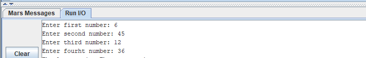
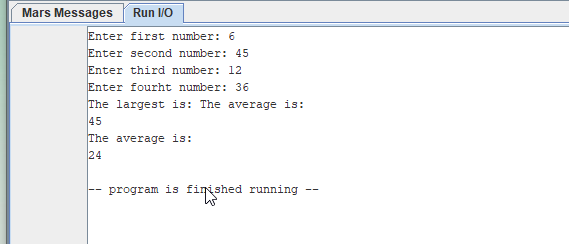

# Module 6 Challenge Activity: MIPS Procedures Recursion and Cache

- [Module 6 Challenge Activity: MIPS Procedures Recursion and Cache](#module-6-challenge-activity-mips-procedures-recursion-and-cache)
	- [Learning Activities](#learning-activities)
	- [Purpose](#purpose)
	- [Skills and Knowledge](#skills-and-knowledge)
	- [Overview](#overview)
	- [Task 1: Collect User Input](#task-1-collect-user-input)
		- [Sample Output Task 1](#sample-output-task-1)
	- [Task 2: Calculate Average and Largest Value](#task-2-calculate-average-and-largest-value)
	- [Task 3: Calculate Larger Value](#task-3-calculate-larger-value)
	- [Final Sample Output](#final-sample-output)

## Learning Activities

The learning activities related to this assignment are in the `la` folder of this
project. If you need to review the concepts, follow the [LA description](la/README.md)

## Purpose

The purpose of this assignment is to give you additional practice working with
procedures that call procedures in MIPS.  We will also explore the effect of working with the stack

## Skills and Knowledge

By the end of this assignment, you should feel comfortable:

1) The stack data structure.
1) The purpose of a program stack, and how to implement it.
2) How to implement reentrant programs.
3) How to store local variables on the stack
4) What recursive subprograms are, and how to implement them.

## Overview

In this program you are required to implement a procedure which takes `4 numbers` in the argument registers `$a0...$a3`, and
returns the `largest value` and the `average` in `$v0` and `$v1` to the calling program. 

The program must be structured as follows:

```c
int* Largest_Avg($a1, $a2, $a3, $a4)
{
	int var0 = $a0, var1 = $a1, var2 = $a2, var3 = $a3;
	$s0 = getLarger($a1, $a2);
	$s0 = getLarger($s0, $a3);
	$v0 = getLarager(s0, $a4); // Largest is in $v0
	$v1 = (var0 + var1 + var2 + var3)/ 4; // Average is in $v1
	return; // returns two values
}

int Get_Larger($a0, $a1) 
{
	$v0 = $a0
	if ($a1 > $a0)
	$v0 = $a1
	return;
}
```

## Task 1: Collect User Input

Your first task is to prompt the user to enter 4 numbers. Inside the `main` procedure, call the subprograms in  `utils.asm` library to collect those values. 

You should capture your input in the following registers: 

```mips
	# register conventions
	# $s0 - num1
	# $s1 - num2
	# $s2 - num3
	# $s3 - num4
```

### Sample Output Task 1



## Task 2: Calculate Average and Largest Value

Next, you need to define a procedure that takes four input parameters. Your should first determine which value is the largest (see Task 3), the the average of the four input parameters.  

The procedure should have the following signature:

```mips
###############################################################
# Desc: Calculate the largest number from all the input 
#		parameters and the average of the 4 numbers
# Argument parameters:
# $a0 - num1
# $a1 - num2
# $a2 - num3
# $a3 - num4
# Return Value:
# $v0 - largest number
# $v1 - average of numbers
# Uses: 
# $s0: num1
# $s1: num2
# $s2: num3
# $s3: num4
Largest_Avg:
 	## Begin Save registers to Stack
	# ............
 	## End Save registers to Stack

 	# Now your function begins here
  
 	# TODO: Get largest value between $s0 and $s1, store in $s4
	# ............
	# jal Get_Larger
	# ............

 	# TODO: Get largest value between $s4 and $s2, store in $s5
	# ............
	# jal Get_Larger
	# ............
 
 	# TODO: Get largest value between $s5 and $s3, store in $s6
	# ............
	# jal Get_Larger
	# ............
 	
	# TODO: Calculate average and store it in $s7
	# The average will be for integer division `div`
	# ............
	
Largest_Avg_End:
 	# Set Return values
 
 	## Begin Restore registers from Stack
	# ............
 	## End Restore registers from Stack
    jr $ra
###############################################################
```

## Task 3: Calculate Larger Value

Your next task consist in defining a procedure that takes two input parameters and return the the larger value. This is the procedure you should call multiple times inside your `Largest_Avg` procedure to determine the largest value of the 4 input parameters. 

The procedure should have the following signature:

```mips
###############################################################
# Desc: Calculate the larger number from two inputs 
# Argument parameters:
# $a0 - num1
# $a1 - num2
# Return Value:
# $v0 - largest number
# Uses: 
# $s0: num1
# $s1: num2
Get_Largest:
 	## Begin Save registers to Stack
	# ............
 	## End Save registers to Stack

 	# Now your function begins here
 	  
 	# TODO: Calculate largest numb store it in $s2
	# ............

Get_Largest_End:
 	# Set Return value
	# ............
 	
 	## Begin Restore registers from Stack
	# ............
 	## End Restore registers from Stack
 
    jr $ra
###############################################################
```

## Final Sample Output 
